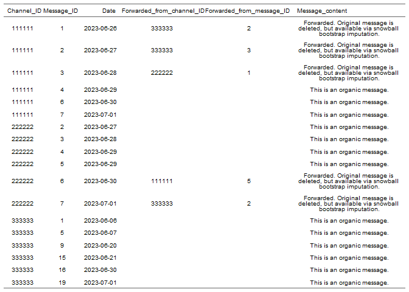
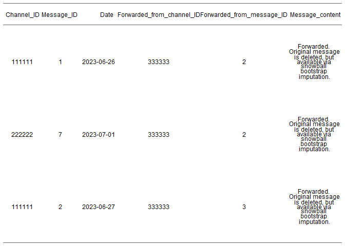
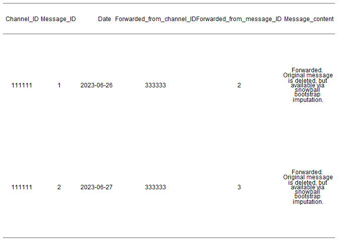

<!-- README.md is generated from README.Rmd. Please edit that file -->

# Snowball bootstrap imputation of Telegram data with snowimputr

This package includes convenient functions to identify deleted messages
in Telegram datasets using the consecutive numbering of message IDs when
Telegram data is scraped via the Telethon API. Those IDs are then
queried in the overall dataset to reconstruct the original message
history of the dataset.

## Installation

You can install snowimputr from GitHub with:

``` r
# install.packages("devtools")
devtools::install_github("buehlk/snowimputr")
```

First, this package allows for quick checks about the extent of deleted
messages in the Telegram dataset. The message IDs within a channel (or
group) are always numbered consecutively, if scraped via Telethon.
Therefore, missing numbers in a sequence mark a deleted message. This
can also be very useful to make sense of possible gaps within the data.
A Telegram dataset might look like this:

``` r
library(snowimputr)
library(dplyr)

telegram_data <- data.frame(
 Channel_ID = rep(c("111111", "222222", "333333"), each = 6),
 Message_ID = c(c(1:4, 6, 7), c(2:7), c(1, 5, 9, 15, 16, 19)),
 Date = as.Date(c("2023-06-26", "2023-06-27", "2023-06-28", "2023-06-29", "2023-06-30", "2023-07-01",
                  "2023-06-27", "2023-06-28", "2023-06-29", "2023-06-29", "2023-06-30", "2023-07-01",
                  "2023-06-06", "2023-06-07", "2023-06-20", "2023-06-21", "2023-06-30", "2023-07-01"), format = "%Y-%m-%d"),
 Forwarded_from_channel_ID = c(c("333333", "333333", "222222", rep(NA, 3)),
                               c(rep(NA, 4), "111111", "333333"), rep(NA, 6)),
 Forwarded_from_message_ID = c(2, 3, 1, rep(NA, 7), 5, 2, rep(NA, 6)),
 Message_content = c(
   c(rep("Forwarded. Rriginal message is deleted, but available via snowball bootstrap imputation.", 3), rep("This is an organic message.", 3)),
   c(rep("This is an organic message.", 4), rep("Forwarded. Original message is deleted, but available via snowball bootstrap imputation.", 2)),
   rep("This is an organic message.", 6)
 )
 )

flextable::flextable(telegram_data) %>% 
  flextable::align(align = "center") %>% 
  plot()
```



To show all deleted messages in a Telegram dataset, use
*list_deleted_msg*:

``` r
 # Show all deleted messages in dataset:
deleted <- list_deleted_msg(msg_df = telegram_data,
 channel_ID_colname = "Channel_ID",
 message_ID_colname = "Message_ID")
 
flextable::flextable(deleted) %>%  
  flextable::align(align = "center") %>% 
  plot()
```


If one is only interested in the missing messages of one particular
channel, this can also be stated in the *list_deleted_msg* function:

``` r
 # Show the deleted messages of Channel "333333"
deleted2 <- list_deleted_msg(msg_df = telegram_data,
 channel_ID_colname = "Channel_ID",
 message_ID_colname = "Message_ID",
 target_entity = "333333")

flextable::flextable(deleted2) %>%  
  flextable::align(align = "center") %>% 
  plot()
```


Of course, deleted messages might contain important information.
Buehling (2023) shows that missing of Telegram messages impair
computational analyses of Telegram data. Also, deleted messages might be
deleted for strategic reasons, which makes their contents even more
interesting to researchers. If one is interested in the spread of
information, then missing messages might obscure the source of an
information! To find and impute those messages, the dataset is queried
for forwarded messages in all channels and groups of the dataset.
Metadata scraped via Telethon contains information on the channel a
message is forwarded from, as well as the message ID it had in this
channel. This way, one is able to reconstruct previously deleted
messages. The querying can be done using *find_deleted_msg*:

``` r
# Find the messages in the dataset that were deleted but forwarded in other channels
find_all <- find_deleted_msg(
 corpus_df = telegram_data,
 deleted_msg_ids = deleted$Message_ID,
 deleted_channel_ids = deleted$Channel_ID,
 fwd_from_colname = "Forwarded_from_channel_ID",
 fwd_msg_colname = "Forwarded_from_message_ID"
 )

flextable::flextable(find_all) %>%  
  flextable::align(align = "center") %>% 
  plot()
```


If you are again only interested in one particular channel, use:

``` r
# Find the messages in the dataset that were deleted by "333333" but forwarded in other channels
find_particular <- find_deleted_msg(
 corpus_df = telegram_data,
 deleted_msg_ids = deleted2$Message_ID,
 deleted_channel_ids = deleted2$Channel_ID,
 fwd_from_colname = "Forwarded_from_channel_ID",
 fwd_msg_colname = "Forwarded_from_message_ID"
 )

flextable::flextable(find_particular) %>%  
  flextable::align(align = "center") %>% 
  plot()
```

 You
can see that the message ID 2 from channel “333333” has been forwarded
to two different channels and is therefore found twice. You can easily
choos to only show the “oldest” or “latest” forward:

``` r
# Find the messages in the dataset that were deleted by "333333" but forwarded in other channels
find_oldest <- find_deleted_msg(
 corpus_df = telegram_data,
 deleted_msg_ids = deleted2$Message_ID,
 deleted_channel_ids = deleted2$Channel_ID,
 fwd_from_colname = "Forwarded_from_channel_ID",
 fwd_msg_colname = "Forwarded_from_message_ID",
 return_result = "oldest", date_colname = "Date"
 )

flextable::flextable(find_oldest) %>%  
  flextable::align(align = "center") %>% 
  plot()
```



Also, this package lets you conveniently substitute the message ID
column and the channel ID column in the results table for the *original*
channel ID and message ID, so that the resulting table can be
conveniently appended to the original dataset for further analysis!

``` r
# Find the messages in the dataset that were deleted by "333333" but forwarded in other channels
find_oldest_impute <- find_deleted_msg(
 corpus_df = telegram_data,
 deleted_msg_ids = deleted2$Message_ID,
 deleted_channel_ids = deleted2$Channel_ID,
 fwd_from_colname = "Forwarded_from_channel_ID",
 fwd_msg_colname = "Forwarded_from_message_ID",
 return_result = "oldest", date_colname = "Date",
 message_ID_colname = "Message_ID",
 channel_ID_colname = "Channel_ID",
 impute = TRUE
 )

flextable::flextable(find_oldest_impute) %>%  
  flextable::align(align = "center") %>% 
  plot()
```


For more information about the effects of deleted Telegram messages on
the results of computational analyses, see:

Buehling, K. (2023). Message Deletion on Telegram: Affected Data Types
and Implications for Computational Analysis. *Communication Methods and
Measures*, 1-23.
